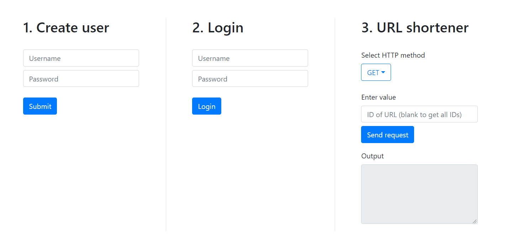

# Assignment 2 - RESTful microservices architectures

## Setup
### Install dependencies
```
npm i
```
### Run React app
```
npm start
```
The app can be accessed in your browser from http://localhost:3000.

### Run node server
Open a new terminal and run
```
cd backend
node index.js
```
The node server runs from http://localhost:5000.


## How to use

### 1. Create a user
There are no restrictions for username or password format, but both fields need to be filled in.  

The user is stored in a local array, and will not be saved when the application is exited.

### 2. Login
Enter a user's username and password to get access to the URL shortener service.

### 3. URL shortener
Use the dropdown to select the type of action you want to perform: **GET**, **POST**, **PUT** or **DELETE**.  

- GET
  - Enter the ID of an URL to retrieve the full URL
  - Leave the input field blank to retrieve the IDs of all stored URLs
- POST
  - Enter an URL to shorten. The URL must be properly formatted  (e.g. http://*www.example.com*)
- PUT
  - Enter the ID of an URL to update
  - Enter the new URL that you want to associate with the ID
- DELETE
  - Enter the ID of an URL to delete
  - Leave the input field blank to delete all stored URLs 


